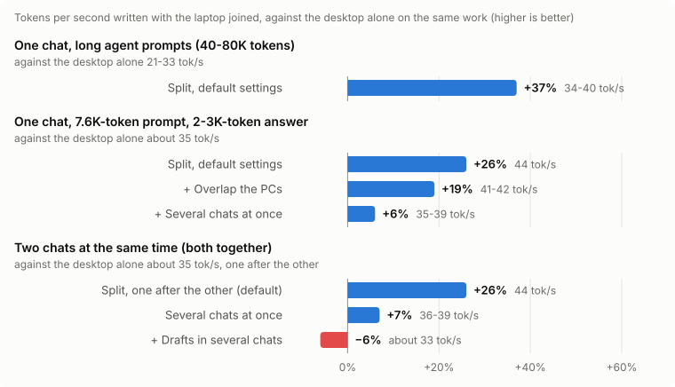

<h1 align="center">StrataPool</h1>

<b>Strata, pooled: several PCs on your network as one</b>

> **This is StrataPool's README, not Strata's.** StrataPool is a fork of [Strata](https://github.com/Niko1221/Strata)
> by Niko1221, kept in step with its releases. For everything about Strata itself (the model and its sizes, which
> graphics cards and how much RAM, the app, the API, troubleshooting), read
> **[Strata's own README](https://github.com/Niko1221/Strata#readme)**. It all applies to StrataPool unchanged.

StrataPool adds a **Pool** tab that lets Strata use more than one PC:

- **Split layers:** the PCs divide one model's layers. Each holds its layers' experts in its own VRAM and RAM and its
  share of the context, so together they cache far more of the model than one PC can.
- **Share requests:** every PC runs the whole model. A chat runs on the PC that holds its conversation, else on an
  idle one, so two chats (or an agent's subtasks) run on two PCs at once.

## A laptop made our desktop 26-37% faster

We joined a gaming laptop to a desktop that already ran Strata. With **Split layers** at its default settings, the
same model and the same coding agent went from **21-33 tokens/s to 34-40** on long agent prompts, and from about 35
to **44** on shorter ones. Nothing else changed: no new GPU, no new RAM.

**Where the speed comes from:** memory, not compute. On its own, the desktop's 12 GB card held 50-67% of the experts
each word needs, and its CPU computed the rest. Split, each PC caches the experts of its own layers, so 81-84% of
them were on a GPU. A pool never adds the GPUs together on one word: each word passes through the layers in turn, so
the PCs take turns. That is why the gain is largest when a model is too big for one PC to cache well, and why Share
requests adds chats, not speed per chat.

### The PCs

| | Coordinator (desktop) | Worker (laptop) |
| --- | --- | --- |
| GPU | RTX 3060, 12 GB | RTX 5060 Laptop GPU, 8 GB |
| CPU | Core i5-12600KF | Core i7-14650HX |
| RAM | 64 GB | 32 GB |
| Layers (automatic split) | 0-24 (0-28 with Several chats on) | 25-47 (29-47) |

Both on Windows, on a home LAN with a 0.6-0.8 ms round trip (200-800 KiB cross it per decode window). Model:
Qwen3.8-Flash-Next **coder IQ1_M**, 256K context with the K/V streamed from RAM (`--kv int8 --kv-resident`), the
sampling in the shipped config (temperature 0.6, presence penalty 1.0). StrataPool on Strata 0.1.40, October 2026.
Measured through a coding agent (dsh); a run's speed moves about ±10% with the text it writes, so read ranges, not
decimals. The desktop-alone figure for the shorter prompts (about 35 tok/s) is its calibration run on Strata 0.1.39;
the long-prompt one was measured on the same agent work as the split.

### Every run

| Setup (Pool tab) | Writes (tok/s) | Against the desktop alone | Window | Notes |
| --- | ---: | ---: | ---: | --- |
| Desktop alone, long agent prompts (40-80K tokens) | 21-33 | | | 50-67% of the routed experts cached in VRAM |
| **Split, defaults**, the same prompts | **34-40** | **+37%** | 49-56 ms | 81-84% cached: the laptop's VRAM holds its layers' experts |
| **Split, defaults**, 7.6K-token prompt, 2-3K-token answer | **44** | **+26%** | 38 ms | reads the prompt at ~600 tok/s (940-980 tok/s on 40K prompts) |
| + Overlap the PCs | 41-42 | +19% | 41 ms | slower than the defaults here: too many guessed windows are thrown away |
| + Several chats at once, one chat running | 35-39 | +6% | 44-49 ms | the extra chat's VRAM costs the laptop 4 layers |
| Two chats at once, one after the other | 44 | +26% | | the default: the second chat waits |
| Two chats at once, Several chats at once | 36-39 together | +7% | | each chat about half that; each keeps its repetition penalties |
| + Drafts in several chats | ~33 together | −6% | | |
| Very predictable text (a TCP explainer) | up to 54 | | 95 ms | 5 accepted words per window |

**What to expect:** the defaults (Several chats Off, Overlap Off) were the fastest on this pair. A split is worth it
when the model is too big for one PC's VRAM to cache well, as here. The other switches are there for pools with a
different balance (a fast worker, a slow network, many agents), so measure them on your own PCs before keeping one on.

## What you need

- Two or more PCs on the same local network, each able to run Strata
  ([what Strata needs](https://github.com/Niko1221/Strata#what-you-need)). For Split layers, each needs an NVIDIA
  card (RTX 20 or newer, 8 GB or more) and **the same model and size** installed.
- A wired network is best. Wi-Fi works, but slower.

## Install

[Download StrataPool](https://github.com/fragtion/StrataPool/archive/refs/heads/main.zip) and unzip it (or
`git clone` it) on every PC. **Windows:** double-click **`START-HERE.bat`**. **Linux:** run **`./setup.sh`**. Setup
asks the same questions as Strata's and finds the models an existing Strata install already downloaded.

The first start compiles StrataPool's engine (10-20 minutes, once; setup installs the compiler and the CUDA toolkit
itself), because Strata's ready-made engines do not include the layer split. Share requests works with any engine.

Then run `POOL-FIREWALL.bat` as administrator on each PC, open the app's **Pool** tab and pick a mode. The steps for
each mode, every setting, what each PC holds and what is not supported yet: **[docs/POOL.md](docs/POOL.md)**.
`POOL-SELFTEST.bat` checks the whole split on one PC first.

## Branches

`main` is Strata's history plus one commit holding all of StrataPool's changes; that commit is replaced at each sync,
so `main` is force-pushed. Every change one by one is on
**[`pool-support`](https://github.com/fragtion/StrataPool/tree/pool-support)**, which has the same files as `main` and
only moves forward. When Strata rewrote its own history (October 2026), `pool-support`'s commits were replayed onto it
once; both branches from before that are kept as the tags `archive/main-before-upstream-rewrite` and
`archive/pool-support-before-upstream-rewrite`.

## Credits and license

The engine, the installer, the app and almost everything else is [Strata](https://github.com/Niko1221/Strata) by
Niko1221 and its contributors ([support Strata](https://buymeacoffee.com/strataengine)). The model is
[Qwen3.8-Flash-Next](https://huggingface.co/Qwen/Qwen3.8-Flash-Next) by the Qwen team; Strata's README lists the
compressed versions and every credit. StrataPool is open source under the [MIT License](LICENSE), like Strata. A few
parts and every model have their own licenses ([which ones](docs/HOW_IT_WORKS.md#license)).

## Contributing

Pull requests, forks, issues and suggestions are all welcome.

---

## Support

If StrataPool has been useful to you, consider buying me a coffee:

**PayPal:**   
**BTC:** `1Q4QkBn2Rx4hxFBgHEwRJXYHJjtfusnYfy`  
**XMR:** `4AfeGxGR4JqDxwVGWPTZHtX5QnQ3dTzwzMWLBFvysa6FTpTbz8Juqs25XuysVfowQoSYGdMESqnvrEQ969nR9Q7mEgpA5Zm`
