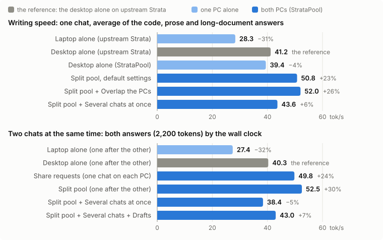

<h1 align="center">StrataPool</h1>

<b>Strata, pooled: several PCs on your network as one</b>

> **This is StrataPool's README, not Strata's.** StrataPool is a fork of [Strata](https://github.com/Niko1221/Strata)
> by Niko1221, kept in step with its releases. For everything about Strata itself (the model and its sizes, which
> graphics cards and how much RAM, the app, the API, troubleshooting), read
> **[Strata's own README](https://github.com/Niko1221/Strata#readme)**. It all applies to StrataPool unchanged.

StrataPool adds a **Pool** tab that lets Strata use more than one PC:

- **Split layers:** the PCs divide one model's layers. Each holds its layers' experts in its own VRAM and RAM and its
  share of the context, so together they cache far more of the model than one PC can.
- **Share requests:** every PC runs the whole model. A chat runs on the PC that holds its conversation, else on an
  idle one, so two chats (or an agent's subtasks) run on two PCs at once.

## A laptop joined to a desktop: 23-33% faster than the desktop alone

We joined a gaming laptop to a desktop that already ran Strata and measured both against each PC alone, with the
same model, the same requests and the same settings. Upstream Strata 0.1.40.1, built the same way, is the reference.

- **One chat writes 23% faster** on average with Split layers at its default settings (50.8 against 41.2 tokens/s),
  and up to 33% on prose. That is 61-109% faster than the laptop alone.
- **Overlap the PCs** adds a little more (52.0 tokens/s, +26%), now that it serves the verified window first.
- **Two chats at once** get through 30% more tokens per second on the split, one after the other (52.5 tokens/s for
  both), and 24% more with Share requests (one chat on each PC).
- **Switching between agent conversations is instant on the split too:** each switch read 24-33 new tokens and took
  the other 3,300-3,500 from parked conversations, as one PC does.

**Where the speed comes from:** memory, not compute. The desktop's 12 GB card holds about 2,300 of the model's
experts and its CPU computes the rest. Split, each PC caches the experts of its own layers (the laptop 1,762 of
layers 29-47), so more of every word runs on a GPU. A pool never adds the GPUs together on one word: each word
passes through the layers in turn, so the PCs take turns. That is why the gain is largest when a model is too big
for one PC to cache well, and why Share requests adds chats, not speed per chat.

**What it costs:** reading a prompt. The split read a 9,800-token document at 696 tokens/s against the desktop's
1,030 alone: each chunk also passes through the laptop's layers, and the laptop reads prompts about 2.4 times slower
than the desktop (its 8 GB card holds few experts of its own). Agent turns that add a few hundred tokens to a
parked conversation are barely touched.

### The PCs

| | Coordinator (desktop) | Worker (laptop) |
| --- | --- | --- |
| GPU | RTX 3060, 12 GB (PCIe 4.0 x16) | RTX 5060 Laptop GPU, 8 GB |
| CPU | Core i5-12600KF (6P + 4E) | Core i7-14650HX (8P + 8E) |
| RAM | 64 GB | 32 GB |
| Context | 256K, K/V int8 streamed from RAM | 192K, K/V int8 streamed from RAM |
| Calibrated (`--calibrate`) | PCIe share 0.35, draft floor 0.70, 5 CPU workers | PCIe share 0.20, draft floor 0.30, 7 CPU workers |
| Layers in the split (automatic) | 0-28, with the embedding, the head and the draft layer | 29-47 |

Both on Windows 11, on a home LAN with a 0.6-0.8 ms round trip (100-350 KiB cross it per decode window).
Model: Qwen3.8-Flash-Next **coder IQ1_M**. Measured on 2026-10-06 with **[tools/pool_bench.py](tools/pool_bench.py)**:
greedy decoding with the shipped penalties (presence 1.0 over 512 tokens) and thinking off, so every setup writes
the same text; each run starts its prompts with its own id, so no cache from an earlier run helps. Upstream Strata
0.1.40.1 was compiled with the same compiler, CUDA 13.0 and flags as StrataPool, with the same config and expert
profile. The raw results are in [bench/results/2026-10-06-stratapool](bench/results/2026-10-06-stratapool). A run
moves by about ±3% between repeats (the desktop's two runs each), so read ranges, not decimals.

### Writing speed (tokens/s)

| Setup | Code (1,200 tokens) | Prose (1,000) | Answer to a 9.8K-token document | Agent's first turn |
| --- | ---: | ---: | ---: | ---: |
| Laptop alone, upstream Strata | 31.9 | 25.0 | 28.1 | 25.2 |
| Desktop alone, upstream Strata | 46.3 | 39.3 | 37.9 | 38.9 |
| Desktop alone, StrataPool | 43.5-44.5 | 37.5-38.2 | 35.6-37.2 | 35.3-36.6 |
| **Split pool, defaults** | **51.3** | **52.2** | **48.8** | **49.6** |
| + Overlap the PCs | 55.4 | 50.5 | 50.1 | |
| + Several chats at once (one chat running) | 48.4 | 39.7 | 42.8 | 42.5 |

Single runs (two for the desktop alone); StrataPool and upstream alone are the same speed once runs are alternated
(see What we learned).

### Two chats at the same time

| Setup | Both answers (2,200 tokens) | Each chat |
| --- | ---: | --- |
| Laptop alone / desktop alone (one after the other) | 27.4 / 40.3 tokens/s | one waits for the other |
| Share requests | 49.8 tokens/s | one on each PC: 37.8 on the desktop, 30.7 on the laptop |
| **Split pool (one after the other)** | **52.5 tokens/s** | one waits, but each runs at the split's speed |
| Split pool, Several chats at once | 38.4 tokens/s | together, but a chat in a slot writes without drafts (19.9) |
| + Drafts in several chats | 43.0 tokens/s | the slot chat still wrote at 21 |

### Reading prompts (tokens/s)

| Setup | 9.8K-token document | 3.3K-token agent start | ~560 tokens | ~2,100 | ~3,000 |
| --- | ---: | ---: | ---: | ---: | ---: |
| Laptop alone, upstream Strata | 265 | 242 | 186 | 244 | 271 |
| Desktop alone, upstream Strata | 1,030 | 819 | 349 | 812 | 911 |
| Desktop alone, StrataPool without CPU help | 1,013-1,021 | 817-821 | 348-353 | 814-815 | 910-917 |
| Desktop alone, StrataPool with CPU help | 1,021-1,029 | 799-812 | **387-394** | 766-776 | 838-845 |
| Split pool | 696 | 552 | 358 | 525 | 565 |

The CPU help (from architectds' fork) read ~560-token prompts 11% faster. Staging chunks up to 3,072 tokens for it,
as architectds does on PCIe 3.0, made 2-3K-token prompts 5-8% slower on the desktop's PCIe 4.0 x16, so StrataPool now
keeps the assist below 1,024 tokens (`STRATA_PREFILL_CPU_STAGE=3072` brings their setting back).

### What we learned

- **Defaults first.** Split layers with Several chats Off is the fastest setup on this pair, for one chat and for two
  chats one after the other. Overlap the PCs is now a small gain (code +8%, prose -3%, the document answer +3%); keep
  it if your own replies are mostly code.
- **Several chats at once is still a loss here,** with or without drafts: the extra slot costs the laptop VRAM, and a
  chat in a slot writes at about half speed. It is for pools that serve many agents at once, not for one user.
- **Each PC alone, StrataPool is as fast as upstream.** The single runs above differ by a few percent either way,
  which is the noise: a greedy reply's words still drift between runs (experts computed on the GPU or the CPU round
  differently, and the CPU threads add in varying order), and with them how many drafts each window accepts.
  Alternating the two engines twice each with expert swaps and the PCIe share off ([`ab-*`
  runs](bench/results/2026-10-06-stratapool)): desktop code / prose / document 36.8 / 30.6 / 28.0 tok/s on StrataPool
  against 35.0 / 30.1 / 27.7 upstream, the same time per window (82 / 66 / 87 ms against 83 / 64 / 85); laptop 25.8 /
  22.1 / 23.8 against 25.8 / 20.5 / 23.9, with repeats of the same engine 10% apart. Prompt reading is the same,
  faster on short prompts with the CPU help.
- In real agent sessions at 40-80K tokens of context (a coding agent at temperature 0.6, an earlier StrataPool), the
  split wrote 34-40 tokens/s where the desktop alone wrote 21-33.

## What StrataPool adds

- **The Pool tab:** this PC's role (alone, Share requests, split coordinator or worker), the workers found on the
  network, the layer map with each PC's experts in VRAM, and the switches below. Every setting is in
  [docs/POOL.md](docs/POOL.md).
- **Split layers over the network:** a coordinator runs the first layers, the head, sampling and the draft layer;
  workers run the rest. Each PC loads only its own layers' weights and experts, keeps its own share of the context,
  and learns its own expert ranking. The split is placed automatically from each PC's VRAM and RAM (including what
  Windows lets a program pin) and refines itself from the timings it measures.
- **Share requests:** each chat runs on the PC that holds its conversation, else on an idle one; a PC that goes away
  is skipped.
- **Parked conversations across the split:** switching between chats or subagents restores each PC's part of the
  conversation instead of reading it again, and a sibling subagent borrows the shared start of a parked one.
- **Overlap the PCs** (one chat): the coordinator starts the next window while the workers finish the current one.
- **Several chats at once / Drafts in several chats:** batch slots pipelined across the PCs, each chat with its own
  repetition penalties.
- **For each PC alone too:** faster prompt tokenizing on long conversations, CPU help on short prompts, and the fixes
  listed under Credits.

## What you need

- Two or more PCs on the same local network, each able to run Strata
  ([what Strata needs](https://github.com/Niko1221/Strata#what-you-need)). For Split layers, each needs an NVIDIA
  card (RTX 20 or newer, 8 GB or more) and **the same model and size** installed.
- A wired network is best. Wi-Fi works, but slower.

## Install

[Download StrataPool](https://github.com/fragtion/StrataPool/archive/refs/heads/main.zip) and unzip it (or
`git clone` it) on every PC. **Windows:** double-click **`START-HERE.bat`**. **Linux:** run **`./setup.sh`**. Setup
asks the same questions as Strata's and finds the models an existing Strata install already downloaded.

The first start compiles StrataPool's engine (10-20 minutes, once; setup installs the compiler and the CUDA toolkit
itself), because Strata's ready-made engines do not include the layer split. Share requests works with any engine.

Then run `POOL-FIREWALL.bat` as administrator on each PC, open the app's **Pool** tab and pick a mode. The steps for
each mode, every setting, what each PC holds and what is not supported yet: **[docs/POOL.md](docs/POOL.md)**.
`POOL-SELFTEST.bat` checks the whole split on one PC first.

## Branches

`main` is Strata's history plus one commit holding all of StrataPool's changes; that commit is replaced at each sync,
so `main` is force-pushed. Every change one by one is on
**[`pool-support`](https://github.com/fragtion/StrataPool/tree/pool-support)**, which has the same files as `main` and
only moves forward. When Strata rewrote its own history (October 2026), `pool-support`'s commits were replayed onto it
once; both branches from before that are kept as the tags `archive/main-before-upstream-rewrite` and
`archive/pool-support-before-upstream-rewrite`.

## Credits and license

The engine, the installer, the app and almost everything else is [Strata](https://github.com/Niko1221/Strata) by
Niko1221 and its contributors ([support Strata](https://buymeacoffee.com/strataengine)). The model is
[Qwen3.8-Flash-Next](https://huggingface.co/Qwen/Qwen3.8-Flash-Next) by the Qwen team; Strata's README lists the
compressed versions and every credit. StrataPool is open source under the [MIT License](LICENSE), like Strata. A few
parts and every model have their own licenses ([which ones](docs/HOW_IT_WORKS.md#license)).

**Code StrataPool carries that is not (yet) in Strata's own releases.** Thanks to everyone below; each item is credited
in its commit on `pool-support`. Where we measured an effect on the PCs above, it is given; the others are fixes or
were not measured on their own.

| Who | What | What it does for StrataPool |
| --- | --- | --- |
| [architectds](https://github.com/architectds/Strata) | pipelined decode: the verified window served first, the prompt lookup carried across windows, the gate at 0.10 | **Overlap the PCs**, measured 6% slower than the defaults before, now code +8%, prose -3%, the document answer +3% |
| [architectds](https://github.com/architectds/Strata) | CPU-assisted prompt reading | each PC's CPU computes part of a short prompt's experts: ~560-token prompts read **11% faster** on the desktop, on every pool node |
| Guillaume Putier ([gputier/StrataGP](https://github.com/gputier/StrataGP)), with benoit lange - [PR #567](https://github.com/Niko1221/Strata/pull/567) | the prompt tokenized from the last shared prefix | a 110K-token conversation's turn tokenized in 13 ms instead of 601 ms (measured on the Qwen vocabulary) |
| BlueKingMuch - [#1163](https://github.com/Niko1221/Strata/pull/1163), [#1164](https://github.com/Niko1221/Strata/pull/1164) | a parked conversation's reserve kept small; a sibling subagent borrows a parked conversation's start | extended to the split: each PC borrows its own part; sibling subagents stop re-reading each other's history |
| Vadim / tirex999 ([DACAN](https://github.com/tirex999/DACAN)) | parked conversations with KV streaming (the idea) | led to parked conversations across the split (above) |
| Francesco Albano / Hardin22 ([Strata-DualGPU](https://github.com/Hardin22/Strata-DualGPU)) - [#851](https://github.com/Niko1221/Strata/pull/851), [#1166](https://github.com/Niko1221/Strata/pull/1166) | an AVX2 Q8_K quantizer for the CPU experts; `--host-core sibling` for hybrid Intel CPUs (opt-in) | the activations of the CPU experts quantized with AVX2 (not measured on its own here); his pipelined windows, now in Strata, are what Overlap the PCs runs on |
| AncientMystic - [#855](https://github.com/Niko1221/Strata/pull/855) | the PLE page cache without its 45x read amplification | the lookup table's page cache no longer reads the same pages many times over |
| InB4DevOps - [#789](https://github.com/Niko1221/Strata/pull/789) | prompt reading overlaps routed-expert uploads with the shared work | |
| Anon - [#652](https://github.com/Niko1221/Strata/pull/652) | only the tokens a verify window hands out are committed | |
| Fringe210 - [#813](https://github.com/Niko1221/Strata/pull/813) | `--ple-io ram` on Windows (opt-in) | |
| ATIVX928 - [#1019](https://github.com/Niko1221/Strata/pull/1019) | the int8 K/V gather decodes 8 values per thread | |
| imanu - [#1063](https://github.com/Niko1221/Strata/pull/1063) | batch-MTP drafters keep the draft head's type | fixed a crash with **Drafts in several chats** |
| win10ogod - [#1102](https://github.com/Niko1221/Strata/pull/1102), wOvAN - [#1201](https://github.com/Niko1221/Strata/pull/1201) | the batch paths serve their layers per window | fixed a stall in **Several chats at once** while a prompt is read |
| Chen Cheng - [#1185](https://github.com/Niko1221/Strata/pull/1185) | a window graph that finds no VRAM frees older slot graphs | Several chats at once on a full 12 GB card |
| uncle daddy - [#1101](https://github.com/Niko1221/Strata/pull/1101) | prompt staging threads sleep instead of spinning | they no longer compete with the CPU help |
| Maxim Shipko - [#1064](https://github.com/Niko1221/Strata/pull/1064) | commit limits applied after an allocation failure | |

## Contributing

Pull requests, forks, issues and suggestions are all welcome.

---

## Support

If StrataPool has been useful to you, consider buying me a coffee:

**PayPal:**   
**BTC:** `1Q4QkBn2Rx4hxFBgHEwRJXYHJjtfusnYfy`  
**XMR:** `4AfeGxGR4JqDxwVGWPTZHtX5QnQ3dTzwzMWLBFvysa6FTpTbz8Juqs25XuysVfowQoSYGdMESqnvrEQ969nR9Q7mEgpA5Zm`
